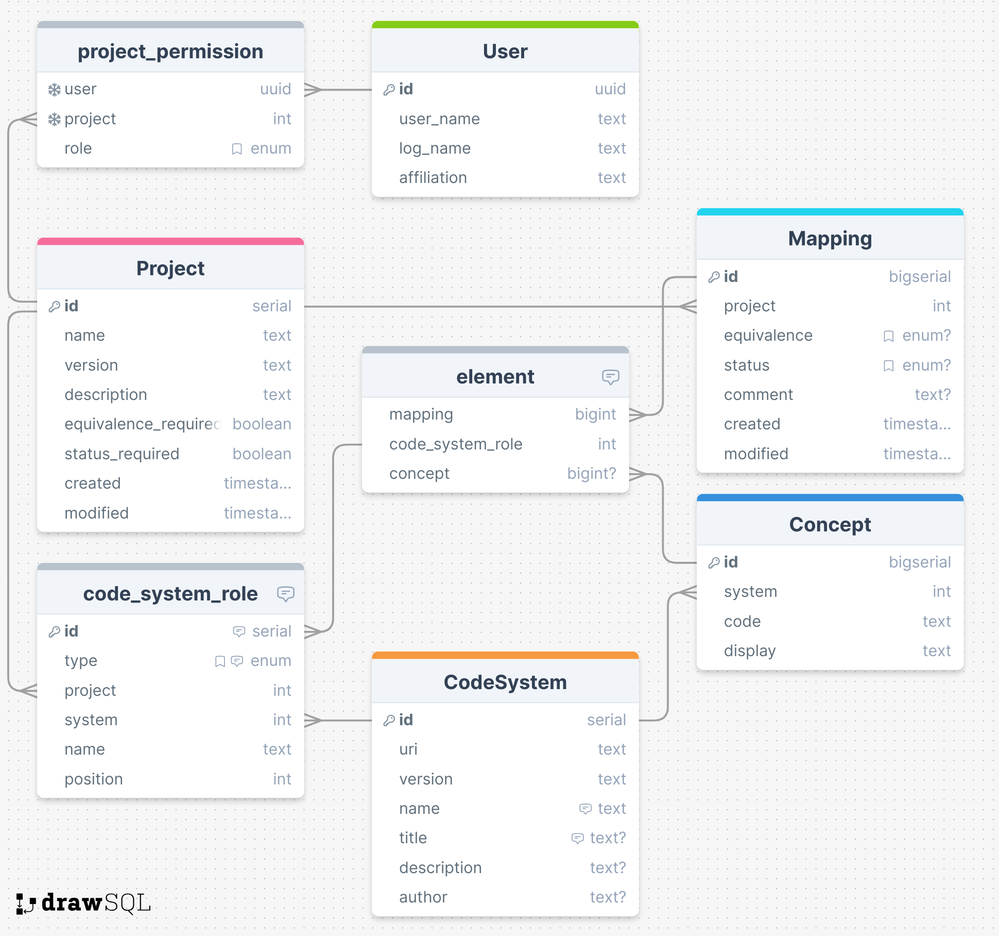

# Database

The structure of the database looks like this:

## General structure

The database is structured in a way that the data is normalized as much as possible. Indexes are used to speed up some queries on large tables like the Concepts. GORM is used to access the Database so the definition of the tables as well as the relations between them are defined in the GOORM Models.

The `CodeSystem` table defines the different codeSystems that can be used in the project. The `Concept` table holds the individual codes of the codeSystems. The `Project` table defines a central entity in the database. A project can have multiple `ProjectPermissions` which define the access rights of a user to a project. A `Project` contains `Mappings` which describe an `n:m` relationship of codes from one codeSystem to others. Which kind of Concepts of a CodeSystem are in a relationship to other Concepts of other CodeSystems is described in the `CodeSystemRole` table. They are defined individually for each project and each can have a type of `source` or `destination` and an association to one specific `CodeSystem`. The `n:m` Mappings are internally represented in the database using the `Elements` table which maps a concept to a specific code_system_role within a `Mapping`.

<!-- - Image of the database from DrawSQL
- Internal Database Triggers and constraints for consistency -->
